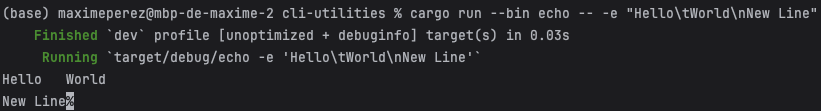
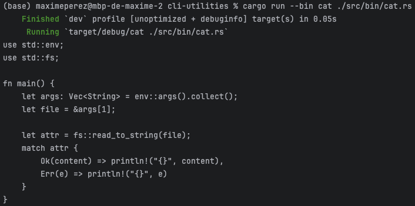
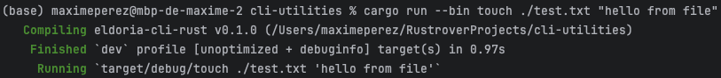
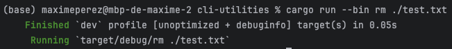
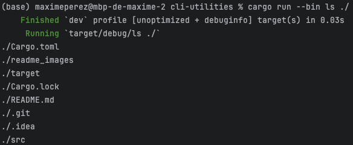
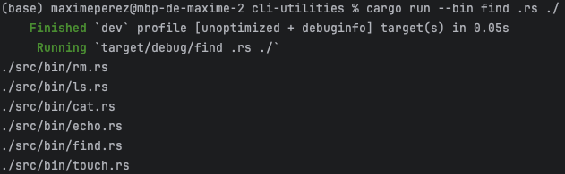

<h1>Simple cli commands in Rust</h1>

---
<h2>echo</h2>

Print any string you want in the terminal.  
You can use -e as flag to convert \n as carriage return and \t as tabulation.  

<u>Usage</u>:  

---
<h2>cat</h2>

Show the content of a file

<u>Usage</u>:  

---
<h2>touch</h2>

Create a file with the content you want inside.  

<u>Usage</u>:

(It created a 'file.txt' with the content 'hello from file' inside)
---
<h2>rm</h2>

Delete a file

<u>Usage</u>:  
  
(it deleted the file 'file.txt')
---
<h2>ls</h2>

list the files inside a directory

<u>Usage</u>:  

---
<h2>find</h2>

Find all files that match the pattern starting from a given directory

<u>Usage</u>:  
